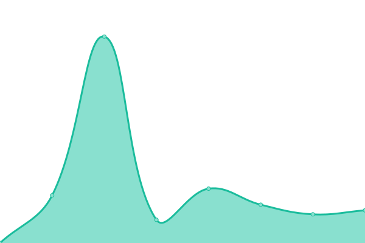
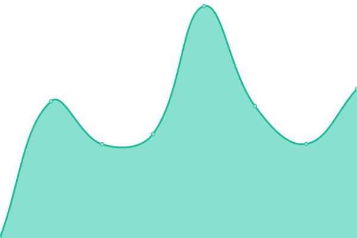

# [📈 Live Status](https://upptime.github.io/upptime): <!--live status--> **🟧 Partial outage**

This repository contains the open-source uptime monitor and status page for [Upptime](https://upptime.js.org), powered by [Upptime](https://github.com/upptime/upptime).

With [Upptime](https://upptime.js.org), you can get your own unlimited and free uptime monitor and status page, powered entirely by a GitHub repository. We use [Issues](https://github.com/upptime/upptime/issues) as incident reports, [Actions](https://github.com/Kamva/products-uptime/actions) as uptime monitors, and [Pages](https://upptime.github.io/upptime) for the status page.

<!--start: status pages-->
<!-- This summary is generated by Upptime (https://github.com/upptime/upptime) -->
<!-- Do not edit this manually, your changes will be overwritten -->
<!-- prettier-ignore -->
| URL | Status | History | Response Time | Uptime |
| --- | ------ | ------- | ------------- | ------ |
|  [Kamva Landing](https://kamva.ir) | 🟩 Up | [kamva-landing.yml](https://github.com/Kamva/products-uptime/commits/HEAD/history/kamva-landing.yml) | 

 2523ms
     
 | 

<a href="https://Kamva.github.io/products-uptime/history/kamva-landing">83.57%</a>
    

|  [Kamva Blog](https://blog.kamva.ir) | 🟩 Up | [kamva-blog.yml](https://github.com/Kamva/products-uptime/commits/HEAD/history/kamva-blog.yml) | 

 2455ms
     
 | 

<a href="https://Kamva.github.io/products-uptime/history/kamva-blog">83.67%</a>
    

|  [Kamva Admin](https://admin.kamva.ir/login) | 🟩 Up | [kamva-admin.yml](https://github.com/Kamva/products-uptime/commits/HEAD/history/kamva-admin.yml) | 

 2289ms
     
 | 

<a href="https://Kamva.github.io/products-uptime/history/kamva-admin">83.69%</a>
    

|  [Kamva Storefront](https://kawaiishop.ir) | 🟩 Up | [kamva-storefront.yml](https://github.com/Kamva/products-uptime/commits/HEAD/history/kamva-storefront.yml) | 

 3413ms
     
 | 

<a href="https://Kamva.github.io/products-uptime/history/kamva-storefront">91.68%</a>
    

|  [Kamva Support](https://support.kamva.ir) | 🟩 Up | [kamva-support.yml](https://github.com/Kamva/products-uptime/commits/HEAD/history/kamva-support.yml) | 

 10090ms
     
 | 

<a href="https://Kamva.github.io/products-uptime/history/kamva-support">80.77%</a>
    

|  [Pakat Landing](https://pakat.net) | 🟩 Up | [pakat-landing.yml](https://github.com/Kamva/products-uptime/commits/HEAD/history/pakat-landing.yml) | 

 2160ms
     
 | 

<a href="https://Kamva.github.io/products-uptime/history/pakat-landing">83.51%</a>
    

|  [Pakat Profile](https://profile.pakat.net) | 🟩 Up | [pakat-profile.yml](https://github.com/Kamva/products-uptime/commits/HEAD/history/pakat-profile.yml) | 

 1901ms
     
 | 

<a href="https://Kamva.github.io/products-uptime/history/pakat-profile">83.60%</a>
    

|  [Pakat Support](https://help.pakat.net) | 🟩 Up | [pakat-support.yml](https://github.com/Kamva/products-uptime/commits/HEAD/history/pakat-support.yml) | 

 4848ms
     
 | 

<a href="https://Kamva.github.io/products-uptime/history/pakat-support">82.48%</a>
    

|  Pakat API | 🟥 Down | [pakat-api.yml](https://github.com/Kamva/products-uptime/commits/HEAD/history/pakat-api.yml) | 

 0ms
     
 | 

<a href="https://Kamva.github.io/products-uptime/history/pakat-api">0.00%</a>
    

<!--end: status pages-->

[**Visit our status website →**](https://upptime.github.io/upptime)

## 📄 License

- Powered by: [Upptime](https://github.com/upptime/upptime)
- Code: [MIT](./LICENSE) © [Upptime](https://upptime.js.org)
- Data in the `./history` directory: [Open Database License](https://opendatacommons.org/licenses/odbl/1-0/)
